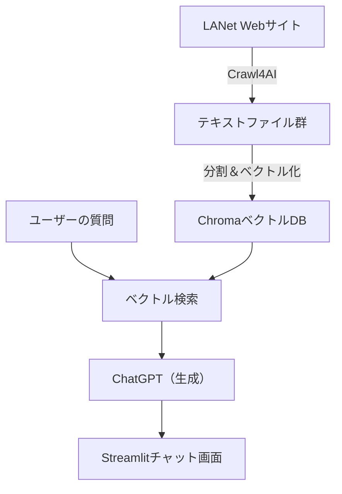

# 🧠 ラシキアゼミ向け AIチャットボット開発レクチャー

---

## 🎯 ゴール

ラシキアゼミのWebサイト（https://lanet.sist.chukyo-u.ac.jp/）の情報をもとに、  
質問に自動で答える**AIチャットボット**を構築する。

---

## 🛠 使用技術一覧

| 技術         | 内容 |
|--------------|------|
| Crawl4AI     | Webサイトをクロールしてテキスト抽出 |
| Chroma       | テキストをベクトル形式で保存・検索 |
| LangChain    | ベクトル検索・RAG構成の支援 |
| OpenAI API   | ChatGPTモデルで回答生成 |
| Streamlit    | 簡単なWebチャットUIを作成 |

---

## 🔧 準備

### 1. Python環境を整える

Python 3.9 以上（3.10も可）

```bash
python -m venv venv
venv\Scripts\activate  # Mac の場合: source venv/bin/activate
```

### 2. 必要なパッケージをインストール

requirements.txtからインストール
```bash
crawl4ai
langchain
chromadb
openai
tiktoken
streamlit
python-dotenv
```

<br>


```bash
pip install -r requirements.txt
```

### 3. OpenAI APIキーの準備
.envファイルの作成
```ini
OPENAI_API_KEY=sk-xxxxxxxxxxxxxxxxxxxxxxxxxxxxx
```

---

## 🗺️ アーキテクチャ構成図（RAG）


---
<div style="page-break-after: always;"></div>


## ✅ ステップ1：サイトをクロール（データ収集）
このステップでは、crawl4ai を用いて ラシキアゼミWebサイトの複数ページをクロールし、Markdown形式の本文を .txt ファイルとして保存します。CLIは使用せず、Pythonスクリプトから直接 AsyncWebCrawler を制御します。
```python
# crawl_lanet_session_save.py
import asyncio
from typing import List
from crawl4ai import AsyncWebCrawler, BrowserConfig, CrawlerRunConfig
from crawl4ai.markdown_generation_strategy import DefaultMarkdownGenerator
import os
import re

# クロール対象URL（必要に応じて追加）
TARGET_URLS = [
    "https://lanet.sist.chukyo-u.ac.jp/",
    "https://lanet.sist.chukyo-u.ac.jp/activities",
    "https://lanet.sist.chukyo-u.ac.jp/societies",
    "https://lanet.sist.chukyo-u.ac.jp/researches",
    "https://lanet.sist.chukyo-u.ac.jp/jobs",
    "https://lanet.sist.chukyo-u.ac.jp/members",
    "https://lanet.sist.chukyo-u.ac.jp/links"
]

# 保存先ディレクトリ
OUTPUT_DIR = "lanet_data"
os.makedirs(OUTPUT_DIR, exist_ok=True)

def sanitize_filename(url: str) -> str:
    return re.sub(r'[^\w\-_.]', '_', url.strip("/"))[:100]

async def crawl_sequential_and_save(urls: List[str]):
    print("\n=== Crawl4AI + セッション再利用 + Markdown保存 ===")

    browser_config = BrowserConfig(
        headless=True,
        extra_args=["--disable-gpu", "--disable-dev-shm-usage", "--no-sandbox"],
    )

    crawl_config = CrawlerRunConfig(
        markdown_generator=DefaultMarkdownGenerator()
    )

    crawler = AsyncWebCrawler(config=browser_config)
    await crawler.start()

    try:
        session_id = "lanet_session"
        for url in urls:
            result = await crawler.arun(
                url=url,
                config=crawl_config,
                session_id=session_id
            )

            if result.success:
                print(f"✅ Success: {url}")
                filename = sanitize_filename(url)
                path = os.path.join(OUTPUT_DIR, f"{filename}.txt")
                with open(path, "w", encoding="utf-8") as f:
                    f.write(result.markdown.raw_markdown or "")
                print(f"📄 保存: {path}")
            else:
                print(f"❌ Failed: {url} - {result.error_message}")
    finally:
        await crawler.close()
        print("✅ クロール完了（すべてのセッションを閉じました）")

async def main():
    await crawl_sequential_and_save(TARGET_URLS)

if __name__ == "__main__":
    asyncio.run(main())
```
・結果：lanet_data/ フォルダに .txt ファイル群が保存されます。

✅ Markdown（MD形式）にする主な理由

| 対象     | MD形式での利点                  |
| ------ | ------------------------- |
| 検索精度   | 見出し単位・段落単位の関連性が明確になる      |
| LLM回答  | 「このテーマについて」の問いに一貫した文脈で返せる |
| 将来の再利用 | PDF・HTML化・表示にも応用しやすい      |

✅ 他との比較まとめ（表）
| ツール                  | 特徴                               | 向いている用途                  |
| -------------------- | -------------------------------- | ------------------------ |
| **Crawl4AI**         | Markdown出力、非同期、Playwright、RAG最適化 | AIチャットボット、RAG前処理、LLM学習素材 |
| **BeautifulSoup**    | 軽量、シンプル、カスタム解析容易                 | 小規模スクレイピング、特定要素の抽出       |
| **Scrapy**           | 高速・拡張性・クローラ管理                    | 大規模Webクローリング、制御が必要な場合    |
| **Selenium**         | JSレンダリング、操作再現性あり                 | 自動化・ブラウザ操作が必要な検証系        |
| **readability-lxml** | 主要本文抽出に特化（簡単）                    | ニュースやブログなど読みやすさ重視の抽出     |


## ✅ ステップ2：ベクトルDBを構築（LangChain + Chroma）
build_vector_db.py
```python
from langchain_community.document_loaders import DirectoryLoader, TextLoader
from langchain.text_splitter import RecursiveCharacterTextSplitter
from langchain_openai import OpenAIEmbeddings
from langchain_community.vectorstores import Chroma
from dotenv import load_dotenv
import os

# .env から OPENAI_API_KEY を読み込み
load_dotenv()

# Markdownファイル読み込み
loader = DirectoryLoader(
    "lanet_data",
    glob="**/*.txt",
    loader_cls=lambda path: TextLoader(path, encoding="utf-8")
)
docs = loader.load()
print(f"📄 ドキュメント数: {len(docs)}")

# チャンク分割
splitter = RecursiveCharacterTextSplitter(chunk_size=500, chunk_overlap=50)
split_docs = splitter.split_documents(docs)
print(f"✂️ 分割後ドキュメント数: {len(split_docs)}")

# OpenAI 埋め込み + Chromaへ保存
embedding = OpenAIEmbeddings(openai_api_key=os.getenv("OPENAI_API_KEY"))
db = Chroma.from_documents(split_docs, embedding, persist_directory="lanet_chroma_md")

print("✅ ベクトルDB作成完了（Markdown対応）")
```
実行コマンド
```bash
python build_vector_db.py
```

## ✅ ステップ3：チャットボットアプリを構築（Streamlit）
app.py
```python
import streamlit as st
from dotenv import load_dotenv
import os

from langchain_community.document_loaders import DirectoryLoader, TextLoader
from langchain_openai import ChatOpenAI, OpenAIEmbeddings
from langchain_chroma import Chroma
from langchain.chains import RetrievalQA

# .envからAPIキーを読み込み
load_dotenv()

st.title("ラシキア研究室チャットボット 🤖")
query = st.text_input("質問を入力してください")

# ベクトルDBロード
embedding = OpenAIEmbeddings(openai_api_key=os.getenv("OPENAI_API_KEY"))
db = Chroma(persist_directory="lanet_chroma_md", embedding_function=embedding)

# チャットモデルとRAGチェーンの設定
llm = ChatOpenAI(temperature=0, model_name="gpt-3.5-turbo", openai_api_key=os.getenv("OPENAI_API_KEY"))
qa = RetrievalQA.from_chain_type(llm=llm, retriever=db.as_retriever())

# 応答処理
if query:
    with st.spinner("考え中..."):
        result = qa.invoke({"query": query})
        st.success(result["result"])
```

## ✅ ステップ4：Streamlitアプリを起動
```bash
streamlit run app.py
```

## ✅ 動作例

質問例：<br>
・「LANetゼミの研究テーマは何ですか？」<br>
・「ゼミではどんな活動がありますか？」<br>
・「卒業研究について教えてください」<br>
"# ChatBot_crawl4AI" 
